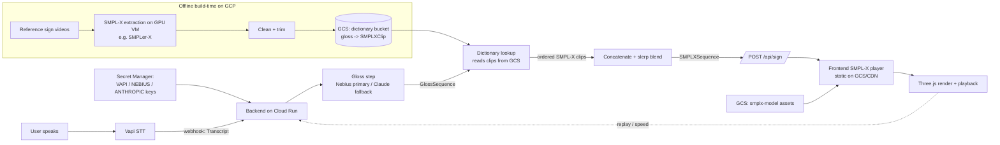

# PRD / Build Spec — Voice-to-ASL Signing Avatar (POC)

**Status:** Handoff-ready v1.1 (GCP + Nebius/Claude + Claude Code agents)
**Scope:** POC only. Path A pipeline. No RL, no generative SLP model, no robotics.
**One-liner:** User speaks → 3D SMPL-X avatar signs the utterance in ASL in the browser, over a bounded vocabulary.

> **Read this first (agents):** Build against the **Data Contracts in §3** — they are frozen interfaces. Stages communicate only through these schemas. Infra is **GCP** (§7). LLM gloss uses **Nebius primary / Claude fallback** (§4.2). Acceptance criteria are in §6; the Claude Code agent topology is in §9.

---

## 1. Locked decisions
- **Voice → text:** Vapi, webhook → backend. STT only.
- **Text → ASL:** English → (optional) LLM ASL gloss → dictionary lookup of pre-built SMPL-X clips → concatenate + blend. **Bounded vocabulary.**
- **Pose representation:** **SMPL-X** params (body + hands + face). Canonical interface.
- **Render:** SMPL-X mesh driven directly, **Three.js**, in-browser. SMPL-X body *is* the avatar.
- **Infra:** **GCP** (Cloud Run, GCS, Artifact Registry, Secret Manager, Compute Engine GPU for offline build).
- **LLM:** **Nebius** (OpenAI-compatible) primary for gloss tokens; **Anthropic Claude API** fallback.
- **Build:** **Claude Code**, orchestrator main agent + sub-agents per workstream.
- **Quality bar:** low accuracy acceptable; this is an experiment.

### 1a. Non-goals (POC)
No generative text→pose model, no RL, no back-translation. No retargeting to a stylized character (SMPL-X mesh only). No sign→text, no telephony. No production communication claims.

---

## 2. Architecture



**Runtime needs no GPU.** Rendering is client-side; gloss is an API call. Only the **offline dictionary build (W6)** uses a GPU VM. Keeps serving cheap.

---

## 3. Data contracts (frozen)

### 3.1 SMPL-X frame & sequence (canonical)
Rotations are axis-angle, radians. `betas` constant per sequence.
```ts
interface SMPLXFrame {
  global_orient:   number[3];
  body_pose:       number[63];    // 21 body joints * 3
  left_hand_pose:  number[45];    // 15 finger joints * 3 (full, NOT PCA)
  right_hand_pose: number[45];
  jaw_pose:        number[3];
  leye_pose:       number[3];     // optional, zero-fill ok
  reye_pose:       number[3];     // optional, zero-fill ok
  expression:      number[10];
  transl:          number[3];     // optional, zero-fill ok
}
interface SMPLXSequence {
  model: "SMPLX_NEUTRAL";
  fps: number;
  betas: number[10];
  frames: SMPLXFrame[];
  meta?: { source_gloss?: string[]; clip_ids?: string[] };
}
```

### 3.2 Dictionary clip
```ts
interface SMPLXClip {
  clip_id: string;
  gloss: string;                  // lexical gloss OR single letter for fingerspell
  kind: "lexical" | "letter";
  fps: number;
  betas: number[10];
  frames: SMPLXFrame[];           // trimmed, rest-pose padded ends
  source?: { video_url?: string; license?: string; extractor?: string };
}
```

### 3.3 Gloss sequence (gloss → lookup)
Tokens are either a lexical gloss (`"HELLO"`) or a fingerspell directive (`"fs:J"`).
```ts
interface GlossSequence {
  english: string;
  gloss: string[];                // e.g. ["MY","NAME","fs:J","fs:A","fs:D","fs:E"]
  unmatched?: string[];
}
```

### 3.4 Vapi → backend webhook (subset)
```json
{ "type": "transcript", "transcript": "hello how are you", "timestamp": 0 }
```

### 3.5 Runtime API
```
POST /api/sign
  body: { "text": "..." }
  200 -> SMPLXSequence
  422 -> { error, unmatched: string[] }
```

---

## 4. Component specs

### 4.1 Vapi integration (W1)
Configure assistant; STT provider for short phrases. Final transcript → Cloud Run `/api/ingest` (or stream then call `/api/sign`). Webhook target = Cloud Run public URL. No LLM/TTS/telephony.

### 4.2 Gloss step (W2) — Nebius primary / Claude fallback
- Input: English string → Output: `GlossSequence` (§3.3).
- **Provider abstraction `GlossProvider`:**
  - **Primary — Nebius (OpenAI-compatible).** OpenAI SDK, `base_url=https://api.tokenfactory.nebius.com/` (confirm current base URL + model name from Nebius docs; older `https://api.studio.nebius.ai/v1/` may still resolve), key `NEBIUS_API_KEY`, an open instruct model (Llama/Qwen/DeepSeek-class).
  - **Fallback — Anthropic Claude API.** Anthropic SDK, key `ANTHROPIC_API_KEY`. Triggered on Nebius error/timeout/invalid output.
- **Prompt:** "Convert English to ASL gloss. Uppercase lexical tokens; drop articles/copula; topic-comment order; emit proper nouns and acronyms as fingerspell directives `fs:<LETTER>` per letter." Treat as best-effort.
- **Hard fallback:** word-by-word passthrough (uppercase, strip punctuation, expand unknown proper nouns to `fs:` letters) when both providers fail.
- **POC note:** the demo script (§5) is fixed — pre-generate and hand-verify its gloss, cache it, so the live demo never depends on a flaky LLM call. The LLM path still handles arbitrary input (low accuracy, expected).

### 4.3 Dictionary lookup (W3)
Input `GlossSequence` → ordered `SMPLXClip[]`. Resolve each token (lexical or `fs:<letter>`) to a clip in the GCS dictionary bucket; collect `unmatched`; 422 on zero matches. Synonym map allowed (e.g. ME↔I).

### 4.4 Concatenate + blend (W4)
Input `SMPLXClip[]` → one `SMPLXSequence`. Blend consecutive clips with **slerp per joint** over K transition frames (never lerp raw axis-angle). Optional rest hold between words. Resample to common `fps`; fixed neutral `betas`.

### 4.5 SMPL-X browser player (W5) — highest risk
Input `SMPLXSequence` → animated mesh in Three.js with play/pause/speed/replay. **No turnkey SMPL-X Three.js loader exists.** Pick one route:
- **Route A (recommended): JS forward pass.** Convert SMPL-X model assets (template verts, shape/pose/expression blendshapes, joint regressor, kinematic tree, skinning weights) from official `.npz`/`.pkl` to a JS-loadable binary; per frame compute `T + B_s(betas) + B_e(expression) + B_p(theta)` then linear blend skinning → push vertices into a Three.js `BufferGeometry`. The body-only SMPL three.js demo is a starting point to extend to hands+face.
- **Route B (fallback): rigged glTF/FBX.** Drive bone rotations from `SMPLXFrame`. Simpler; loses pose-corrective blendshapes.
Must render hands + jaw + expression. Model assets served from GCS bucket `smplx-model`.

### 4.6 Offline dictionary build (W6) — content bottleneck
For each entry in §5: short reference video → off-the-shelf SMPL-X estimator (SMPLer-X / OSX-class) on a **GCP GPU VM** → trim/clean/smooth, rest-pad ends → `SMPLXClip`, written to GCS `dictionary` bucket. Schema-validate every clip. Extraction quality bounds demo quality; manual cleanup expected. **J is a motion letter** — verify its trajectory, not a static pose.

---

## 5. Seed vocabulary (the demo script → dictionary)

**Script:** *"Hello. How are you doing today? My name is Jade. I don't speak sign language, but my AI does. I'm happy to communicate."*

**POC gloss (spot-check with an ASL-fluent reviewer):**
| Sentence | Gloss |
|---|---|
| Hello. | HELLO |
| How are you doing today? | HOW YOU TODAY *(question NMM)* |
| My name is Jade. | MY NAME fs:J fs:A fs:D fs:E |
| I don't speak sign language, but my AI does. | ME SIGN NOT BUT MY fs:A fs:I CAN |
| I'm happy to communicate. | ME HAPPY COMMUNICATE |

**Dictionary entries to build (≈18):**
- **Lexical (13):** HELLO, HOW, YOU, TODAY, MY, NAME, ME, SIGN, NOT, BUT, CAN, HAPPY, COMMUNICATE
- **Letters (5):** J *(motion)*, A, D, E, I

Size the dictionary to exactly cover this script for the POC; expand later.

---

## 6. Tickets & acceptance criteria

| ID | Ticket | Depends | Acceptance |
|----|--------|---------|-----------|
| **W0** | Repo, `schemas` package, CI schema validation, GCP project bootstrap (buckets, AR, SA, Secret Manager) | — | Types published; CI rejects malformed clips; buckets + service account + secrets exist |
| **W5a** | SMPL-X player renders neutral mesh | W0 | Rest-pose SMPL-X mesh renders in Three.js; orbit controls; model assets load from GCS |
| **W5b** | Player animates a sequence | W5a | Canned `SMPLXSequence` plays at fps; play/pause/speed/replay; hands + jaw move |
| **W6** | Dictionary build pipeline + 18 seed clips on GPU VM → GCS | W0 | All 18 §5 entries schema-valid; recognizable in W5b; J motion correct |
| **W2** | Gloss step (Nebius + Claude fallback + passthrough) | W0 | `GlossSequence` for the 5 script lines (cached/verified) + 5 ad-hoc phrases; passthrough works with both providers disabled; `fs:` expansion correct |
| **W3** | Dictionary lookup (reads GCS) | W0, W6 | Maps tokens→clips incl. `fs:`; reports `unmatched`; 422 on zero match |
| **W4** | Concatenate + slerp blend | W0, W3 | One continuous `SMPLXSequence`; no seam discontinuity above threshold; slerp over K frames |
| **API** | `POST /api/sign` on Cloud Run wiring W2→W3→W4 | W2,W3,W4 | text in → valid `SMPLXSequence`; 422 path; deployed to Cloud Run with secrets |
| **W1** | Vapi webhook → API | API | Speaking the 5 script lines triggers signing end-to-end |
| **INT** | Demo UI + framing copy | all | Speak button, replay, speed; "experiment" framing; full script signs; time-to-first-sign < ~2s |

---

## 7. GCP infrastructure

| Concern | Service |
|---|---|
| Backend API (gloss, lookup, blend) | **Cloud Run** (public HTTPS for Vapi + frontend) |
| Container images | **Artifact Registry** |
| Dictionary clips + SMPL-X model assets | **Cloud Storage** buckets: `dictionary`, `smplx-model` |
| Frontend static hosting | **GCS static bucket + Cloud CDN** (or Firebase Hosting) |
| Secrets: `VAPI_API_KEY`, `NEBIUS_API_KEY`, `ANTHROPIC_API_KEY` | **Secret Manager** |
| Offline SMPL-X extraction (W6) | **Compute Engine GPU VM** (L4/T4), build-time only |
| Identity | Cloud Run **service account**: GCS read + Secret Manager accessor; CI via Workload Identity Federation |
| CI/CD (optional) | **Cloud Build** (or GitHub Actions) → build image, deploy Cloud Run, run schema validation |

Use the already-configured project/credentials in the terminal. Recommend Terraform or `gcloud` scripts for buckets, AR repo, SA, and secret wiring (W0).

---

## 8. Repo structure
```
/schemas         # §3 types + validators (W0), imported by back + front
/backend         # Cloud Run service: /api/ingest, /api/sign; gloss (W2), lookup (W3), blend (W4)
/dictionary      # build pipeline (W6); writes SMPLXClip assets to GCS
/frontend        # Three.js SMPL-X player (W5) + demo UI (INT)
/infra           # Terraform / gcloud scripts: buckets, AR, SA, secrets, Cloud Run
/assets/smplx    # converted SMPL-X model assets (uploaded to smplx-model bucket)
CLAUDE.md        # shared context for all agents (points to this spec + conventions)
```

---

## 9. Claude Code build — orchestrator + sub-agents

**Main orchestrator agent**
- Owns `CLAUDE.md`, this spec, and the build order. **Creates and freezes the `schemas` package (W0) and GCP bootstrap first** — nothing spawns until contracts exist.
- Delegates each workstream to a sub-agent with a focused brief = its §4 component spec + §3 schemas + §6 acceptance criteria.
- Owns integration (`/api/sign` wiring, Cloud Run deploy), runs acceptance checks, resolves cross-cutting issues. Does **not** let sub-agents edit `/schemas`.

**Sub-agents (isolated by directory to allow parallel work):**
| Agent | Owns | Tickets | Start |
|---|---|---|---|
| `renderer-agent` | `/frontend` player | W5a, W5b | **immediately** (long pole) |
| `dictionary-agent` | `/dictionary` + GPU VM | W6 | **immediately** (long pole) |
| `gloss-agent` | `/backend` gloss module | W2 | after W0 |
| `pose-agent` | `/backend` lookup+blend | W3, W4 | after W6 lands clips |
| `backend-agent` | Cloud Run API, Vapi, `/infra` deploy, secrets | API, W1 | after W2/W3/W4 |
| `demo-agent` | `/frontend` UI + framing | INT | last |

**Rules for sub-agents:** import `schemas`, never modify it; stay in your directory; test against the frozen contracts with stub data (e.g. renderer uses a canned `SMPLXSequence` before W6 exists); hand back artifacts that pass §6 acceptance. The two long poles (`renderer-agent`, `dictionary-agent`) run in parallel from day one against the schema; the backend chain assembles behind them.

**Build order:** W0 → (renderer ‖ dictionary ‖ gloss) → lookup → blend → API → Vapi → INT.

---

## 10. Risks & gotchas
| Risk | Mitigation |
|---|---|
| No turnkey SMPL-X Three.js renderer | W5 Route A/B decided; start day one |
| Axis-angle seam artifacts | slerp per joint (W4), never lerp raw |
| Jittery/wrong SMPL-X extractions | manual cleanup + smoothing + rest-pad (W6) |
| `J` motion letter rendered as static pose | W6 handles it as a trajectory |
| Live demo broken by flaky LLM | pre-cache verified gloss for the fixed script (W2) |
| Hands look bad (where ASL lives) | full finger pose (45 dims), not PCA |
| Meaningless sign output | honest experiment framing; ASL-literate spot-check |
| Runtime cost creep | no GPU at serving time; GPU only for offline W6 |

## 11. Licensing (flag before any non-POC step)
- **SMPL-X model:** research/non-commercial free; commercial needs a Max Planck / Meshcapade license.
- **Source sign videos / datasets** (e.g. How2Sign = CC-BY-NC): non-commercial only. Fine for POC; gates productization.

## 12. Definition of done (POC)
Speak the demo script → SMPL-X avatar signs a recognizable sequence in the browser, via `POST /api/sign` on Cloud Run, with Nebius→Claude gloss fallback, dictionary clips from GCS, hands+jaw+expression animating, and honest experiment framing. Clips spot-checked by someone ASL-literate.